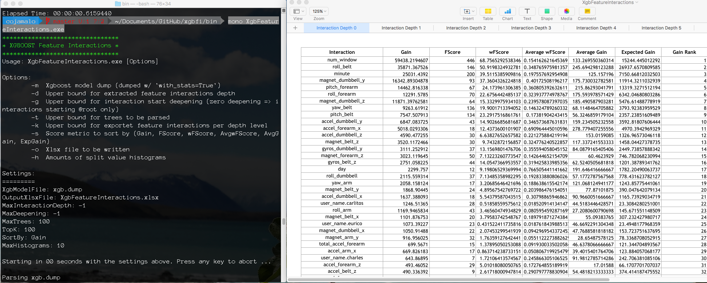

### Submission by Connor Lenio. Email: cojamalo@gmail.com
Completion Date: Jun 18, 2017

* * *

```{r, include=FALSE}
knitr::opts_chunk$set(echo = TRUE,fig.align='center', message = FALSE, warning=FALSE)
setwd('/Users/cojamalo/Documents/JHU - ML/')
fmap_path = "/Users/cojamalo/Documents/GitHub/xgbfi/bin/fmap.txt"
dump_path = "/Users/cojamalo/Documents/GitHub/xgbfi/bin/xgb.dump"
xlsx_path = '/Users/cojamalo/Documents/GitHub/xgbfi/bin/XgbFeatureInteractions.xlsx'
```


## Goal

The goal of the project is to predict the manner in which the subjects did the exercise for five possible movement types A, B, C, D, and E. This is the `classe` variable in the training set. Thus, this project features a multinomial machine learning task where prediction accuracy will be the most important outcome. The project is completed as a submission for the John Hopkins University course, <i>Practical Machine Learning</i>, hosted by Coursera.

* * *

## Setup

### Load packages

```{r load-packages}
library(data.table)
library(pander)
library(lubridate)
library(xlsx)
library(xgboost)
library(statsr)
library(caret)
library(plyr)
library(dplyr)
```

<br>

### Load data
The train and test data was provided by the Coursera course assignment page.
```{r load-data}
train = fread("pml-training.csv", na.strings = "", showProgress = FALSE, drop = "V1") %>% tbl_df
test = fread("pml-testing.csv", na.strings = "", showProgress = FALSE, drop = "V1") %>% tbl_df
```

The data is based on the Weight Lifting Exercises study from the following source:

Velloso, E.; Bulling, A.; Gellersen, H.; Ugulino, W.; Fuks, H. Qualitative Activity Recognition of Weight Lifting Exercises. Proceedings of 4th International Conference in Cooperation with SIGCHI (Augmented Human '13) . Stuttgart, Germany: ACM SIGCHI, 2013.

Read more: http://groupware.les.inf.puc-rio.br/har#weight_lifting_exercises#ixzz4kBkyfAnE

* * *
## Stage 1: Data Preprocessing & Feature Engineering

During Stage 1, the training set's original 159 features will be inspected to identify what information they represent, modified to produce the best formats for the machine learning task, and eliminated from consideration, if necessary. In addition, a XGBoost Gradient Boosting Model will be fit for the sole purpose of identifying important interactions between the features using additional tools provided with the Xgbfi program. These interaction terms will then be added to the training data to use as additional features for fitting the model.

### Feature encodings - extracting unique info from features 

#### Convert features to proper types

The first step is to convert the features to the appropriate types for the information they contain. The following code identifies features that need to be converted to factors and dates, as well as the features that will not be changed and the features that will be removed. These features are saved in separate data frame to be put back together at a later step.
```{r convert-features}
## Convert features to factor type
to_factor = train %>% select(user_name, new_window) %>% tbl_df %>% mutate_if(is.character,as.factor)

## Convert features to date type
to_date = train %>% select(cvtd_timestamp) %>% mutate(cvtd_timestamp = dmy_hm(cvtd_timestamp))

## No change needed
no_chg = train %>% select(num_window:total_accel_belt, gyros_belt_x:total_accel_arm, gyros_arm_x:magnet_arm_z, roll_dumbbell:yaw_dumbbell, total_accel_dumbbell, gyros_dumbbell_x:yaw_forearm, total_accel_forearm, gyros_forearm_x:classe)

## Removal from data for high NA
## > 95%
to_rm = train %>% select(raw_timestamp_part_1, raw_timestamp_part_2, kurtosis_roll_belt:var_yaw_belt, var_accel_arm:var_yaw_arm, kurtosis_roll_arm:amplitude_yaw_arm, kurtosis_roll_dumbbell:amplitude_yaw_dumbbell, var_accel_dumbbell:var_yaw_dumbbell, kurtosis_roll_forearm:amplitude_yaw_forearm, var_accel_forearm:var_yaw_forearm) 

## extra the dependent feature
train_y = select(train, classe)
train_y$classe = factor(train_y$classe)
```

The features that do not need any changes represent numeric values that are already numeric types except for the `classe` variable, which is put into its own data frame called `train_y`. Many of the original features are removed from the data since they are over 95% NA values and, thus, are not informative. 


<br>

#### Creating dummy variables for factor types - one hot encoding

The factor features require additional processing and are converted to separate, numeric factors using one hot encoding. If the factor has only two levels, such as the case with `new_window`, the factor levels are simply converted to either a 0 or 1. This step will ensure that the data is compatible with most learning algorithms as some algorithms are not compatible with the factor type.
```{r convert-factors}
two_level = select(to_factor, new_window)
two_level$new_window = as.numeric(two_level$new_window) - 1
dummies <- dummyVars(classe ~ ., data = bind_cols(train_y, select(to_factor, -new_window)))
to_factor = predict(dummies, newdata = bind_cols(train_y, to_factor)) %>% tbl_df
to_factor = bind_cols(two_level, to_factor)
```

<br>

#### Extracting unique time info from `cvtd_timestamp`

The unique time information is split into new factors for the day, month, year, hour, and minute. This will allow any learning algorithm to pick up on the relationship between each unit of time and `classe`.
```{r convert-dates}
to_date = to_date %>% mutate(day = day(cvtd_timestamp), month = month(cvtd_timestamp), year = year(cvtd_timestamp), hour = hour(cvtd_timestamp), minute = minute(cvtd_timestamp)) %>% select(-cvtd_timestamp)
```

<br>

#### Scale the continuous variables
Finally, the remaining numeric variables are scaled to ensure they are compatible with all learning algorithms. Some algorithms use Euclidean distances or weight coefficients based on the scale of each feature, so scaling ensures all numeric variables have the same scale to eliminate any possible bias unequal scaling could produce.
```{r scale-features}
no_chg = no_chg %>% select(-classe) 

scale_save = function(x) {
    scaled = scale(x)
    center = attributes(scaled)$`scaled:center`
    scale = attributes(scaled)$`scaled:scale`
    return(list(center=center, scale=scale))
    }
scaled_list = apply(no_chg, 2, scale_save)

no_chg = no_chg %>% scale %>% tbl_df %>% apply(2, as.numeric) %>% tbl_df
```

<br>

#### Create dataset of indpendent variables

A data frame with all the independent variables that were processed in the preceding steps is then bound together.

```{r bind-train-x}
train_x = bind_cols(to_factor, to_date, no_chg)
```

<br>

### 2-way, 3-way and 4-way feature interactions 

Often, interactions exist between different features that provide important information for the sake of extracting patterns from the data. Not all learning algorithms account for these interactions, so any important interactions in this dataset will be added to the training set so they are available to any learning algorithm.

#### Identify the most important features using XGBoost

In this case, XGBoost, a gradient boosting algortim that does identify interactions, will be used to identify important interactions between the current features.
```{r fit-interact-model, results="hide", cache=TRUE}
# Prep data for xgboost
train_x_num = as.matrix(train_x)
train_x_label = as.numeric(train_y$classe)
train_x_matrix = xgb.DMatrix(data = train_x_num, label = train_x_label)
# Fit the model
bst <- xgboost(data = train_x_matrix,
               nround = 100, # default 100
               eta = 0.1, # default 0.3
               max.depth = 6, # default = 6 
               gamma = 0, # default 0, if train error >>> test error, bring gamma into action
               min_child_weight = 1, # default = 1
               subsample = 1, # default = 1
               colsample_bytree = 1, # default 1
               objective = "multi:softmax",
               eval_metric = "merror",
               num_class = 6)
```
All the default settings for XGBoost are used except for 0.1 for eta to produce the model `bst`. The eta parameter effects the learning rate of the model and a smaller value means the model is more robust to overfitting. 

<br>

The "Gain" measure is one of the ways to rank features by the amount of information they contribute to the model. 
```{r, fig.width =10, fig.height=6}
# plot the most important features
xgb.plot.importance(xgb.importance(colnames(train_x_num, do.NULL = TRUE, prefix = "col"), model = bst), top_n = 28)
```


This plot shows the top 28 features by information gain. `num_window` and `roll_belt` are two features with the highest gain. 

<br>

To extract the information from the model concerning interactions, the xgbfi program is used. This is run in the terminal on a Mac OS and requires an 'xgb.dump' and 'fmap.txt' file. Fortunately, the xgb.dump function creates these files.
```{r}
# Dump the model to file for Xgbfi
featureList <- names(train_x)
featureVector <- c() 
for (i in 1:length(featureList)) { 
  featureVector[i] <- paste(i-1, featureList[i], "q", sep="\t") 
}
write.table(featureVector, fmap_path, row.names=FALSE, quote = FALSE, col.names = FALSE)
xgb.dump(model = bst, fname = dump_path, fmap = fmap_path, with_stats = TRUE)
```


<br>

#### Use Xgbfi to identify interactions with high information gain

The procedure to find model interactions using Xgbfi is similar to the one found here: http://projects.rajivshah.com/blog/2016/08/01/xgbfi/

Xgbfi was cloned from its [github repository][https://github.com/Far0n/xgbfi]. The 'xgb.dump' and 'fmap.txt' produced in the step above are placed in the same directory as the `XgbFeatureInteractions.exe` program. The program is then run and outputs an excel file with interaction at multiple depths. The following screenshot depicts the terminal command with xgbfi settings and the resulting excel file: 

```{r screenshot, fig.width=10}

```

<br>

The information from Xgbfi is imported back into RStudio using `read.xlsx` from the `xlsx` package.

```{r import-interactions, results="asis", cache=TRUE}
depth0 = read.xlsx(xlsx_path, sheetIndex = 1) %>% tbl_df %>% mutate(interact_order = 1)
depth1 = read.xlsx(xlsx_path, sheetIndex = 2) %>% tbl_df %>% mutate(interact_order = 2)
depth2 = read.xlsx(xlsx_path, sheetIndex = 3) %>% tbl_df %>% mutate(interact_order = 3)
depth3 = read.xlsx(xlsx_path, sheetIndex = 4) %>% tbl_df %>% mutate(interact_order = 4)

interact = bind_rows(depth0, depth1, depth2, depth3)
interact$interact_order = factor(interact$interact_order)

pandoc.table(interact %>% group_by(interact_order) %>% summarize(Q1_gain = quantile(Gain, 0.25), med_gain = median(Gain),  mean_gain = mean(Gain), Q3_gain = quantile(Gain, 0.75), max_gain = max(Gain)))
```
Summary statistics for each number of interactions are computed to review the distribution of information gains for the 2-way, 3-way and 4-way feature interactions as well as for the original features. 

<br>

Then, the interactions in the top 25% of information gain for the level preceding it are added. This filtering step means only the most important feature interactions are added as opposed to all of the possible interactions. For instance, only those 2-way interactions with a gain greater than 2819, the top 25% for the non-interaction terms, are included. This cut off happens to be about the top 75% of two-way interactions in terms of information gain for 2-way interactions.
```{r extract-feature-names}
# Find only interactions with a gain above a certain threshold 
two_way = interact %>% filter(interact_order == 2 & Gain > 2819) %>% select(Interaction) %>% as.matrix
three_way = interact %>% filter(interact_order == 3 & Gain > 6541) %>% select(Interaction) %>% as.matrix
four_way = interact %>% filter(interact_order == 4 & Gain > 8375) %>% select(Interaction) %>% as.matrix
# Function that extracts feature names and replaces a "|" symbol with a ":"
prep_interact_char_vec = function(ord_matrix) {
    ord_matrix = as.character(ord_matrix) 
    for (i in 1:length(ord_matrix)) {
    ord_matrix[i] = gsub("|", ":", ord_matrix[i], fixed = TRUE)
    }
    return(ord_matrix)
}
# Run the function for the three levels of interaction
two_way  = prep_interact_char_vec(two_way )
three_way = prep_interact_char_vec(three_way)
four_way = prep_interact_char_vec(four_way)
```

<br>

#### Add interaction terms to the data

With the names of the important feature interactions extracted, the interactions can now be added to the training set by calculating their values using the `model.matrix` function.
```{r calc-interact-values}
# Function that takes a chacter vector of feature names and creates a matrix with each feature interactions actual values
prep_interacts_tbl = function(ord_char_vec, data) {
    mod_mat_formula = ""
    for (i in 1:length(ord_char_vec)) {
        if (i == 1) {
            mod_mat_formula = paste0(mod_mat_formula, ord_char_vec[i])     
        }
        else {
            mod_mat_formula = paste0(mod_mat_formula, " + ", ord_char_vec[i])  
        }
    }
    mod_mat_formula = paste0("~ ", mod_mat_formula)
    add_matrix = model.matrix(as.formula(mod_mat_formula), data)
    colnames(add_matrix)
    rm_index = c()
    for (i in 1:length(colnames(add_matrix))) {
        if (!grepl(":", colnames(add_matrix)[i], fixed = TRUE)) {
        rm_index = c(rm_index, i)
        }
    }
    add_matrix = add_matrix[,-rm_index]
    colnames(add_matrix) = gsub(":", "_", colnames( add_matrix))
    return(tbl_df(add_matrix)) 
}
# Run the function for the three levels of interaction
two_way_tbl = prep_interacts_tbl(two_way, train_x)
three_way_tbl = prep_interacts_tbl(three_way, train_x)
four_way_tbl = prep_interacts_tbl(four_way, train_x)
glimpse(four_way_tbl)
```
The glimpse above shows an example of the interactions columns.

<br>

#### Stitch together final dataset

The interaction features are then added to the training set and any possible duplicate columns this produces are removed.
```{r}
train_x = bind_cols(train_x, two_way_tbl, three_way_tbl, four_way_tbl)
train_x = train_x[, !duplicated(colnames(train_x))]
```

<br>

### Check for near zero variance

As a final step before modeling, the training set is check for any features with zero variance. Such variables do not provide significant information and can often cause errors in learning algorithms. `nearZeroVar` from the caret package is used in this step. 
```{r near-zero-var, results = "asis", cache=TRUE}
# Identify near zero variance predictors
nzv = nearZeroVar(train_x, names = TRUE, saveMetrics = TRUE)
indexes = rownames(nzv[nzv$nzv,])
pandoc.table(data.frame(indexes = indexes, nzv[nzv$nzv,]) %>% tbl_df %>% arrange(percentUnique))
```

<br>

### Remove zero variance features

While there are four features with near zero variance, the `year` feature is problematic if retained for modeling. All of its entries are for the same year, so it will be removed. The other features are kept as `new_window`, for instance, is an important feature according to the XGBoost analysis above even though only 1% of its entries are unique.

```{r}
train_x = select(train_x, -year)
```

Now, the training data is appropriately preprocessed and ready for modeling.

* * *

## Stage 2: Modelling

To model this data, a random forest will be used. Random forests are an ensemble classifier that consists of many decision trees and is one of the most accurate learning algorithms to use out of the box. It has many advantages including its ability to handle thousands of input variables without variable deletion, resistance to overtraining, and the ability to handle data without preprocessing. The weight lifting data has been preprocessed significantly, so the primary reason a random forest is used here is due to the algorithm's high accuracy, resistance to overtraining, and ability to handle high dimensionality (`train_x` has 147 variables after preprocessing).

<br>

### Fit a random forest model Using the ranger package

The `caret` and `ranger` packages will be combined for this step to fit a random forest model to the training data. The `caret` package will consider different numbers of randomly selected predictors (mtry) as it fits the model. The algorithm makes this selection by estimating the prediction error using a 5x5 K-fold cross validation for each possible setting of the mtry parameter.
```{r fit-ranger, cache=TRUE, results="hide"}
fit_dat = bind_cols(train_x, train_y)
set.seed(123)
model_mtry <- train(
  classe ~ .,
  data = fit_dat,
  tuneLength = 9,
  tuneGrid = data.frame(mtry = c(2:10)),
  method = "ranger",
  trControl = trainControl(method = "repeatedcv", number = 5, repeats = 5, verboseIter = TRUE)
)
```
<br>

Now, the caret model can be printed to find out which mtry value was selected.
```{r}
model_mtry
```

It appears a mtry of 9 yields the greatest prediction accuracy.

<br>

The model is refit with only mtry=9, but, this time, with a 10x10 K-Fold cross-validation to produce a more accurate error estimate.
```{r fit-ranger-final, cache=TRUE, results="hide"}
fit_dat = bind_cols(train_x, train_y)
set.seed(123)
model <- train(
  classe ~ .,
  data = fit_dat,
  tuneLength = 1,
  tuneGrid = data.frame(mtry = c(9)),
  method = "ranger",
  trControl = trainControl(method = "repeatedcv", number = 10, repeats = 10, verboseIter = TRUE)
)
```

* * *


## Model Diagnostics

The performance characteristics of the model are checked using a confusion matrix.
```{r}
mod_pred = data.frame(pred = predict(model, train_x), obs = train_y$classe)
# multiClassSummary(mod_pred, lev = c("A","B","C","D","E"))
confusionMatrix(mod_pred$pred, reference = mod_pred$obs, mode="everything")
```

The model has a 100% accuracy rate for the in-sample data and correctly identifies all the classes. While 100% is the estimated out-of-sample error rate for this model since these accuracy numbers were computed from a 10x10  cross-validation, one should always be skeptical of a perfect model.

<br>

Going into to the details of the cross validation run by the `caret` package, the range of the accuracies for each of the 100 folds (from the 10x10 k-fold cross validation) is calculated. In addition, a bootstrap inference to estimate the median is run as well to estimate the out-of-sample accuracy (error). The median is chosen as the measure of center for estimating accuracy since the accuracies are heavily left skewed towards 100%.  
```{r}
kfold_acc = data.frame(acc=model$resample$Accuracy)
range(kfold_acc$acc)
inference(acc, data = kfold_acc, statistic = c("median"), type = "ci", method = "simulation", boot_method = "se")
```

The minimum accuracy for the cross validation was 0.9985 and the maximum was 1.0000. The median estimate for the actual accuracy is 0.9995 ± 0.0004. Thus, even when splitting the training data into ten random parts, ten different times and fitting the model one hundred different ways, the accuracy was extremely high. Using the training data size as an example, one would expect the model to misclassify 19622 - 0.9995 * 19622 = 9.8, or about ten of the rows in a data set of the same size.  

## Stage 5: Prediction

The final step is to use the model to predict the test data set of 20 unclassified measurements.

### Apply changes to test set
First, all the changes that were applied the training set must be applied to the test set. One major difference in the procedure is the center and scaling information for the training set must be used to scale the test set, or else the scaled test set will not have the correct values.
```{r}
# Convert features to proper types
to_factor = test %>% select(user_name, new_window) %>% tbl_df %>% mutate_if(is.character,as.factor)
to_date = test %>% select(cvtd_timestamp) %>% mutate(cvtd_timestamp = dmy_hm(cvtd_timestamp))
no_chg = test %>% select(num_window:total_accel_belt, gyros_belt_x:total_accel_arm, gyros_arm_x:magnet_arm_z, roll_dumbbell:yaw_dumbbell, total_accel_dumbbell, gyros_dumbbell_x:yaw_forearm, total_accel_forearm, gyros_forearm_x:problem_id)
to_rm = test %>% select(raw_timestamp_part_1, raw_timestamp_part_2, kurtosis_roll_belt:var_yaw_belt, var_accel_arm:var_yaw_arm, kurtosis_roll_arm:amplitude_yaw_arm, kurtosis_roll_dumbbell:amplitude_yaw_dumbbell, var_accel_dumbbell:var_yaw_dumbbell, kurtosis_roll_forearm:amplitude_yaw_forearm, var_accel_forearm:var_yaw_forearm) 
# One hot
two_level = select(to_factor, new_window)
two_level$new_window = as.numeric(two_level$new_window) - 1
dummies <- dummyVars(problem_id ~ ., data = bind_cols(select(test, problem_id), select(to_factor, -new_window)))
to_factor = predict(dummies, newdata = bind_cols(select(test, problem_id), to_factor)) %>% tbl_df
to_factor = bind_cols(two_level, to_factor)
# Extracting unique time info from `cvtd_timestamp`
to_date = to_date %>% mutate(day = day(cvtd_timestamp), month = month(cvtd_timestamp), year = year(cvtd_timestamp), hour = hour(cvtd_timestamp), minute = minute(cvtd_timestamp)) %>% select(-cvtd_timestamp)
# Scale continous variables using training centers and variance
no_chg = no_chg %>% select(-problem_id) 
for (i in 1:ncol(no_chg)) {
    center = scaled_list[[i]]$center    
    scale = scaled_list[[i]]$scale
    no_chg[,i] = scale(no_chg[,i], center = center, scale = scale)
}
no_chg = no_chg %>% tbl_df %>% apply(2, as.numeric) %>% tbl_df
# Create dataset of indpendent variables
test_x = bind_cols(to_factor, to_date, no_chg)
# Prep interact terms
two_way_tbl = prep_interacts_tbl(two_way, test_x)
three_way_tbl = prep_interacts_tbl(three_way, test_x)
four_way_tbl = prep_interacts_tbl(four_way, test_x)
# Stitch final data
test_x = bind_cols(test_x, two_way_tbl, three_way_tbl, four_way_tbl)
test_x = test_x[, !duplicated(colnames(test_x))]
# Remove zero variance
test_x = select(test_x, -year)
```

<br>

### Make final predicitons
The predictions for the twenty new measurements are found using the predict function.
```{r final-pred, results="asis"}
test_pred = data.frame(case=1:20, pred=predict(model, test_x))
pandoc.table(head(test_pred))
```

Only the first six are shown here to protect the integrity of the project for others since this information is public. When the predictions were submitted for the test data on Coursera, the model did achieve a perfect prediction accuracy of 20 out of 20.

* * *

## Project Summary

Most of this project, as with many machine learning projects, was spent on feature engineering and management. Since a random forest model was used, many of the feature manipulations, such as scaling the data and finding interactions, were not as necessary since random forests account for these issues. However, it never hurts to practice feature engineering as it grants greater flexibility for algorithm choice for fitting models. Moreover, if the patterns in the data were not as clear or the classification task was different, the random forest may not have been as successful and other models would have to be used. Either way, the extra steps taken in preprocessing the data help to prepare and extract information from the basic features supplied at the beginning of the project. While the prediction accuracy for the final model is extremely high, it remains to be seen whether it will be as accurate in all instances of bicep curls measurements using the same sensors. However, the model performs perfectly for the prediction goal of this project.
